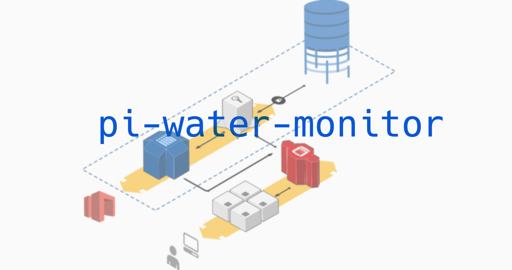
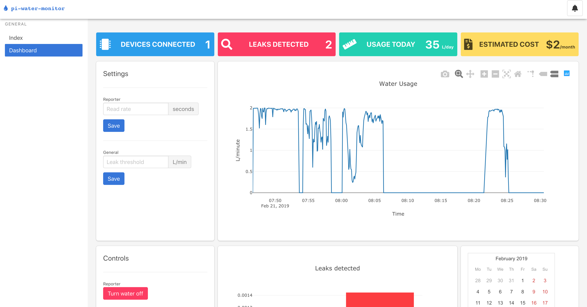
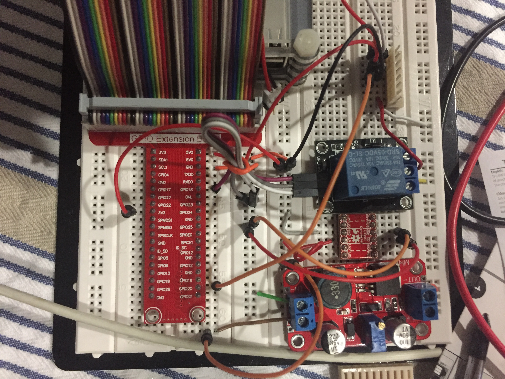

# pi-water-monitor



This project measures and reports water flow remotely with options for leak detection and flow control. It was designed with home use in mind the encourage people to make more informed decisions about water usage. This software package is designed to run on a host machine along with a Raspberry Pi with some connected peripherals.

## Setup
### Dependencies

Devices you will need:
- Host: server or personal computer, needs to be able to run python 3.
- Raspberry Pi: with a sensible OS (I recommend [Raspbian](https://www.raspberrypi.org/downloads/raspbian/) - to run python 3)

##### Software

I have been using [pipenv](https://github.com/pypa/pipenv) to manage my python environment and dependencies. It's a great tool but like most things, it has it's shortcomings... So, I have also included multiple `requirements.txt` files so you can choose how you install your dependencies. [pyenv](https://github.com/pyenv/pyenv) and [virtualenv](https://virtualenv.pypa.io/en/latest/) are some other options to look into, use whatever combination of tools you are comfortable with.

To get started make sure you have a copy of this repo on both your host machine and your Raspberry Pi.
- If you stick with `pipenv`
  - on the host machine (server or personal computer) from the `server/` directory, run `pipenv install`
  - on the Raspberry Pi from the `reporter/` directory, run `pipenv install`
- If you choose another pyhton version manager, or none at all (spicy!)
  - from both the directories `reporter/` on the Raspberry Pi and `server/` on the host, run `pip install -r requirements.txt`

BTW: you will need `python 3.5` (any subversion) to be installed on both machines.

The communication between the two machines is achieved over the [MQTT protocol](https://mqtt.org/faq) you will need an MQTT Broker, if you are familiar with one (or don't wish to host one yourself) go ahead and change the broker address in `server/app.py` and `reporter/main.py` to your brokers address and you are good to go.
If you don't already have one set up, I have been using [Mosquitto](https://mosquitto.org/), go ahead and install that on your host, start it and change those same values accordingly.

### Start the services
Check list:
- Start MQTT Broker
- On your host: from the `server/` directory, run `FLASK_APP=app.py  python -m flask run --host 0.0.0.0`
  - If you are using `pipenv`, don't forget to activate the environment with `pipenv shell` -- do this first
- On you Raspberry Pi: from the `reporter/` directory, run `python main.py`
  -  `pipenv shell` applicable here too!

Then, in your browser, navigate to http://\<ip-address-of-your-host\>:5000/

If you see something like this, you are good to go!


If you are hosting this outside your of local network [here](http://flask.pocoo.org/docs/1.0/deploying/) are some great resources on deploying a flask app. The flask app lives in the `server/` directory so that is what you will be deploying if you choose to.

### Hardware Configuration

You are free to use whatever hardware you like depending on your needs. 
Bare necessities:
- Water flow meter
  - I used a [Sea YF-S401](https://www.dfrobot.com/wiki/index.php/Water_Flow_Sensor_-_1/8%22_SKU:_SEN0216)
- Fluid solenoid
  - I used one of [these](https://www.ebay.com.au/i/303011594323?chn=ps)
- A relay to control the soleniod
  - I used [this one](https://www.auselectronicsdirect.com.au/5v-relay-board-module-for-arduino-projects?gclid=EAIaIQobChMIyOf5qM3M4AIV1AorCh2GdQuqEAkYBiABEgLAlPD_BwE)

Check the specifications of each of your components and make sure they are getting the right amount of power. I had to use a [DC voltage converter](https://www.banggood.com/XL6019-5A-DC-DC-Adjustable-Boost-Power-Module-High-Power-Step-Up-Board-p-1144076.html?utm_design=41&utm_source=emarsys&utm_medium=Shipoutinform171129&utm_campaign=trigger-emarsys&utm_content=Winna&sc_src=email_2671705&sc_eh=c68e4cc37e1f41321&sc_llid=9532774&sc_lid=104858042&sc_uid=wSpXanoMGf&cur_warehouse=CN) 5V->12V to get the required voltage for the solenoid.

The main things to note are the GPIO pins used for interacting with your components:
- Pin 18 is the signal to turn the water off:
  - HIGH value means water is off (solenoid closed)
  - connect this pin to your relays signal input
- Pin 20 water flow meter digital input:
  - connect pin this to your water flow meter's output line
  - You may need to change the calculation depending on what sensor you use, change the frequency modifier in `reporter/reader.py`. 

``` python
# change this to suit your sensor
self.water_total += 1.0 / 5880.0 # in L, (5880 pulses = 1L)

```

Here is what my setup looks like, for your reference.

## Further Development
### Updating the remote device
You may need to tweak some of the code to get it working how you like. I have made a simple script to copy the host version of the repo to your remote device (Raspberry Pi) so you can edit the code on your host machine, and sync it with the other easily.

Set the variables in the `update-device` script according to your setup and run it to update the remote device, it will drop you into a prompt where you can run the up-to-date program.

### Contribution
Feel free to fork or submit pull requests in this repo, create an issue if you have problems or general questions.

If you are extra excited, here is my TODO list. If you want to contribute one to one of these features, create and issue so we can keep in sync.

#### TODO:
- Add scheduling system to leak threshold, incorporate time of day into leak detection to make it more accurate.
- Add proper time controls to reporting on the dashboard.